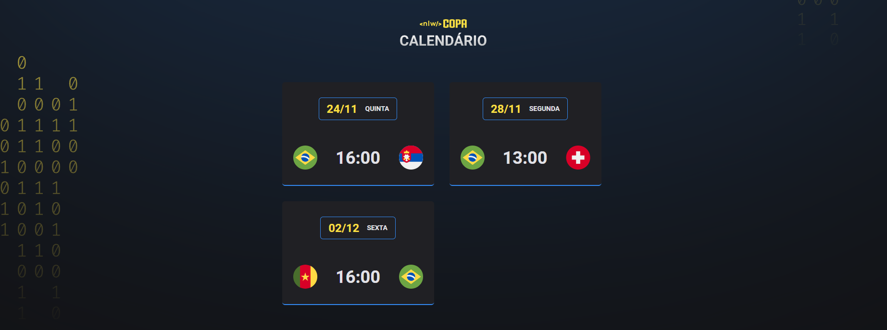

<h1 align="center"> NLW Copa </h1>

Evento exclusivo e gratuito, promovido pela Rocketseat para ensino de tecnologias WEB.

  <a href="#-tecnologias">Tecnologias</a>&nbsp;&nbsp;&nbsp;|&nbsp;&nbsp;&nbsp;
  <a href="#-projeto">Projeto</a>&nbsp;&nbsp;&nbsp;|&nbsp;&nbsp;&nbsp;
  <a href="#-layout">Layout</a>&nbsp;&nbsp;&nbsp;|&nbsp;&nbsp;&nbsp;
  <a href="#memo-licença">Licença</a>

  

 

  

## 🚀 Tecnologias

Esse projeto foi desenvolvido com as seguintes tecnologias:

- HTML e CSS
- JavaScript
- Git e Github

## 💻 Projeto

O NLW-Copa é um layout de calendario que pode ser usado para curtir os jogos da copa de uma forma mais divertida.

## 🔖 Layout

Você pode visualizar o layout do projeto através [DESSE LINK](<https://www.figma.com/file/Pe4uVQSBedpkOGyRvyu4dA/Calend%C3%A1rio-de-Jogos-(Community)?node-id=0%3A1>). É necessário ter conta no [Figma](https://figma.com) para acessá-lo.

## :memo: Licença

Esse projeto está sob a licença MIT.

---

Feito durante o NLW-Copa da rocketseat.

## ❤️ Contato

- Sinta-se a vontade para clonar o repositorio e editar com os jogos que voce desejar e criar um lembrete para curtir os jogos de uma forma bem mais divertida.

- kennedyosilveira@outlook.com
